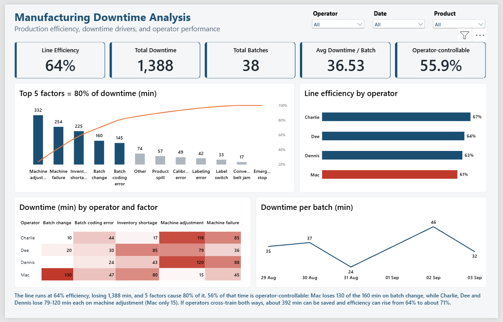
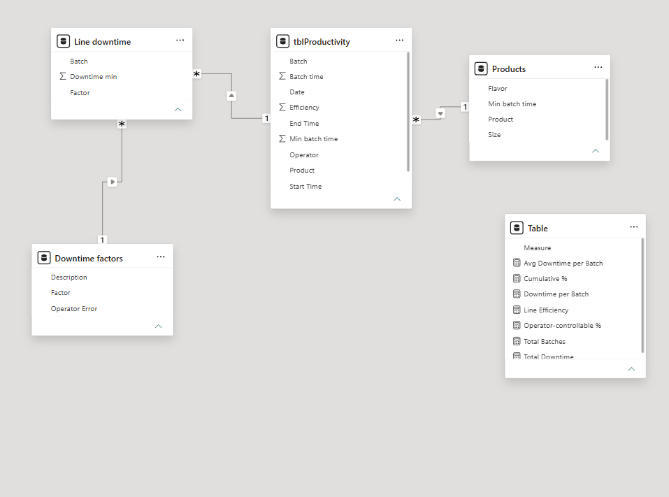
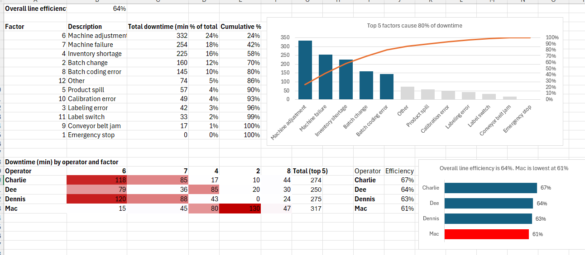

# 🏭 Manufacturing Downtime Analysis

**Finding 392 minutes of recoverable downtime on a soft drink bottling line, using Excel, Power BI and DAX.**



## 📌 Headline Result

The line runs at **64% efficiency** and loses **1,388 minutes** to downtime. **56%** of that downtime is operator-controllable. Cross-training operators in both directions can lift efficiency to about **71%**, saving roughly **392 minutes**.

## 🎯 Business Problem

Bottling lines earn money only while they run. Unplanned stops, changeovers and shortages quietly drain output and margin. I analyzed 38 production batches from a Philadelphia soft drink line to answer three questions:

1. How efficient is the line?
2. Which downtime factors matter most?
3. Where can operators improve, and who can help whom?

## 📊 Key Metrics

| KPI | Value |
|---|---|
| Line efficiency | **64%** (2,470 ideal min / 3,858 actual min) |
| Total downtime | **1,388 min** |
| Total batches | 38 |
| Avg downtime per batch | 36.5 min |
| Operator-controllable downtime | **55.9%** (776 min) |

## 🔍 Key Insights

**1. Five factors cause 80% of downtime.** Machine adjustment (332 min), machine failure (254), inventory shortage (225), batch change (160) and batch coding error (145) make up 80.4% of all lost time.

**2. Operators have opposite strengths.**

| Operator | Batch change (min) | Machine adjustment (min) | Efficiency |
|---|---|---|---|
| Charlie | 10 | 118 | 66.8% |
| Dee | 20 | 79 | 64.1% |
| Dennis | 0 | 120 | 63.2% |
| Mac | **130** | **15** | 60.9% |

Mac loses 130 of the 160 batch-change minutes but handles machine adjustment best. The other three handle batch change well and lose 79 to 120 minutes each on machine adjustment.

**3. No sustained improvement over time.** Downtime per batch peaked at 46 min on 02 Sep. The best day was 31 Aug at 24 min. 03 Sep had one batch only, so it should not be read as a trend.

## ✅ Recommendations

1. **Mac coaches machine adjustment.** If the others reach Mac's level, about 272 min are saved.
2. **Charlie, Dee and Dennis coach batch change.** If Mac reaches their level, about 120 min are saved.
3. **Track efficiency weekly** after training and rerun the Pareto to confirm the gain.

**Estimated impact:** 2,470 / (3,858 minus 392) = **71.3% efficiency**, up from 64%.

> This is an estimate that assumes every operator reaches the best operator's level on each factor. It ignores product mix (the 2 L product has a longer minimum batch time). Mac and Dennis each ran 8 batches, so operator gaps are a starting point for coaching, not a performance judgment.

## 🧰 Approach

1. **Data model:** batches, downtime minutes, downtime factors and products linked in Power BI.
2. **Cleaning and validation:** batch time from start and end times, downtime defined as actual minus minimum batch time, factor minutes reconciled to batch downtime with 0 differences.
3. **Excel analysis:** efficiency, Pareto chart, operator by factor heatmap.
4. **Power BI dashboard:** KPI cards, Pareto, operator comparison, heatmap, trend, slicers.
5. **Insight and action:** operator-error flag used to separate controllable causes and build the recommendation.



## 📈 Excel Analysis



## 🧮 Key DAX Measures

```DAX
Operator-controllable % =
DIVIDE (
    CALCULATE ( SUM ( 'Line downtime'[Downtime min] ), 'Downtime factors'[Operator Error] = "Yes" ),
    SUM ( 'Line downtime'[Downtime min] )
)
```

```DAX
Cumulative % =
VAR cur = SUM ( 'Line downtime'[Downtime min] )
VAR cumul =
    CALCULATE (
        SUM ( 'Line downtime'[Downtime min] ),
        FILTER (
            ALL ( 'Downtime factors'[Description] ),
            CALCULATE ( SUM ( 'Line downtime'[Downtime min] ) ) >= cur
        )
    )
VAR total = CALCULATE ( SUM ( 'Line downtime'[Downtime min] ), ALL ( 'Downtime factors' ) )
RETURN
    DIVIDE ( cumul, total )
```

Other measures: Line Efficiency, Total Downtime, Total Batches, Avg Downtime per Batch.

## ✔️ Data Validation

I recomputed every dashboard figure independently from the raw data (efficiency, totals, factor totals, operator efficiency, heatmap cells, daily trend). All values matched.

## 🚀 Future Work

1. Control for **product mix** when comparing operators.
2. Collect more batches per operator before drawing operator level conclusions.
3. Add **shift and time of day** analysis to see when downtime clusters.
4. Add **cost impact** (lost output value per downtime minute) to rank fixes by money.
5. Build a **weekly efficiency tracker** to measure the real gain after cross-training.
6. Test **predictive maintenance** signals for machine failure, the second largest factor.

## 🛠️ Tools

Excel, Power BI, DAX

## 📁 Repository Structure

```
Manufacturing-Downtime-Analysis/
├── README.md
├── dashboard/          Power BI file (.pbix)
├── data/               Raw data
├── Excel_Analysis/     Excel workbook
├── documentation/      Project presentation and notes
└── screenshots/        Dashboard, data model, Excel images
```

## ▶️ How to Use

1. Download `dashboard/Dashboard.pbix`.
2. Open it in **Power BI Desktop** (free, Windows).
3. Use the slicers for Operator, Date and Product.

Dataset note: sample data from a public analytics case study. It contains no real company information.

---

# 📬 Author & Connect

**Seema Kumari**

- LinkedIn: [linkedin.com/in/seema-kumari-375763308](https://linkedin.com/in/seema-kumari-375763308)
- Email: [kriseema87@gmail.com](mailto:kriseema87@gmail.com)
- GitHub: [github.com/seema-kri](https://github.com/seema-kri)
- LeetCode: [leetcode.com/u/seemakri136/](https://leetcode.com/u/seemakri136/)

## ⭐ If this project was useful, a star on the repo is appreciated.
